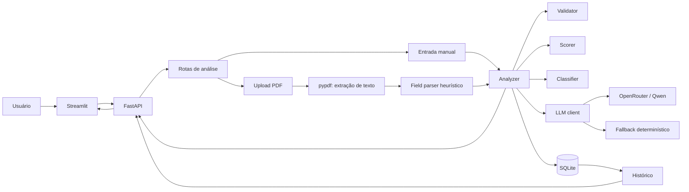
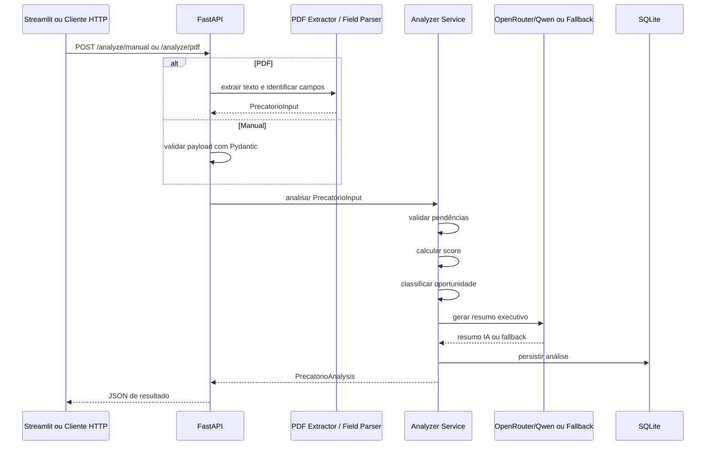

# Precatorio Insight Pipeline

MVP educacional de uma esteira de pré-análise de precatórios. O projeto recebe dados por formulário ou PDF, estrutura as informações, valida campos mínimos, calcula um score documental, aplica regras transparentes de classificação comercial simulada, gera um resumo executivo com LLM e salva o resultado em SQLite.

> O foco aqui é demonstrar uma pipeline técnica completa, simples de executar localmente e fácil de explicar: API, frontend, schemas, parsing, validação, regras de negócio, integração com IA generativa, persistência e testes.

## Índice

- [Visão Geral](#visão-geral)
- [Stack Técnica](#stack-técnica)
- [Arquitetura](#arquitetura)
- [Como a Pipeline Funciona](#como-a-pipeline-funciona)
- [Mapa do Código](#mapa-do-código)
- [Contratos de Dados](#contratos-de-dados)
- [Regras de Score e Classificação](#regras-de-score-e-classificação)
- [Endpoints](#endpoints)
- [Como Rodar](#como-rodar)
- [Exemplos](#exemplos)
- [Testes](#testes)
- [Segurança e Limitações](#segurança-e-limitações)
- [Melhorias Futuras](#melhorias-futuras)

## Visão Geral

Empresas que analisam oportunidades envolvendo precatórios precisam organizar documentos, identificar dados críticos e priorizar casos antes de uma avaliação humana mais profunda. Este projeto simula essa primeira triagem com uma abordagem determinística e auditável, usando IA generativa apenas para apoiar a geração do resumo executivo.

O sistema não emite parecer jurídico, não aprova crédito e não deve ser usado com dados reais sensíveis. Ele foi criado para estudo, portfólio técnico e demonstração de automação aplicada a um fluxo de negócio realista.

### O que o MVP entrega

| Capacidade | Como funciona | Resultado |
| --- | --- | --- |
| Entrada manual | Usuário preenche campos no Streamlit ou envia JSON para a API | Objeto `PrecatorioInput` validado pelo Pydantic |
| Upload de PDF | API recebe um PDF e extrai texto com `pypdf` | Texto livre convertido em campos estruturados |
| Parsing heurístico | Regex e padrões de rótulo identificam campos comuns | Dados normalizados para o schema da aplicação |
| Validação documental | Campos obrigatórios são verificados por regras explícitas | Lista de pendências |
| Score de completude | Pesos determinam uma nota de 0 a 100 | Score com detalhamento por critério |
| Classificação simulada | Regras determinísticas combinam score, valor e pendências | Prioridade comercial simulada |
| Resumo executivo | Qwen via OpenRouter ou fallback determinístico | Síntese segura e orientada a negócio |
| Histórico local | Análises são salvas em SQLite | Consulta via API e frontend |

## Stack Técnica

| Tecnologia | Uso no projeto | Onde aparece |
| --- | --- | --- |
| Python | Linguagem principal da API, serviços e testes | `app/`, `tests/` |
| FastAPI | API HTTP, validação de payloads e documentação interativa | `app/main.py`, `app/routes/analysis_routes.py` |
| Pydantic | Schemas de entrada, resposta, score e resumo | `app/schemas.py` |
| Streamlit | Interface local para formulário, upload de PDF e histórico | `frontend/streamlit_app.py` |
| SQLite | Persistência local das análises estruturadas | `app/database.py`, `app/models.py` |
| pypdf | Extração de texto de PDFs enviados | `app/services/pdf_extractor.py` |
| OpenAI SDK | Cliente OpenAI-compatible para chamar modelo via OpenRouter | `app/services/llm_client.py` |
| OpenRouter/Qwen | Provedor/modelo sugerido para resumo com IA | `.env.example`, `app/services/llm_client.py` |
| python-dotenv | Carregamento de variáveis do arquivo `.env` | `app/config.py`, `frontend/streamlit_app.py` |
| Requests | Comunicação do Streamlit com a API FastAPI | `frontend/streamlit_app.py` |
| Pytest | Testes unitários de parser, validação, score, classificação e LLM fallback | `tests/` |

## Arquitetura



### Fluxo de processamento



## Como a Pipeline Funciona

A pipeline principal está em `app/services/analyzer.py`. Ela recebe um `PrecatorioInput` já estruturado ou chama o parser quando a origem é um texto extraído de PDF.

| Etapa | Entrada | Processamento | Saída | Código |
| --- | --- | --- | --- | --- |
| 1. Recepção | JSON manual ou arquivo PDF | Rotas recebem payload, validam tipo de arquivo e acionam serviços | Dados ou texto extraído | `app/routes/analysis_routes.py` |
| 2. Extração de PDF | Bytes do PDF | `PdfReader` extrai texto de cada página | Texto livre | `app/services/pdf_extractor.py` |
| 3. Parsing | Texto livre | Regex localiza rótulos, número de processo, tribunal, moeda e data | `PrecatorioInput` | `app/services/field_parser.py` |
| 4. Normalização | Campos brutos | Pydantic remove strings vazias e converte moeda brasileira para `float` | Dados normalizados | `app/schemas.py` |
| 5. Validação | `PrecatorioInput` | Campos obrigatórios são checados | Lista de pendências | `app/services/validator.py` |
| 6. Score | `PrecatorioInput` | Pesos por campo preenchido geram nota de 0 a 100 | `DocumentCompletenessScore` | `app/services/scorer.py` |
| 7. Classificação | Dados, score e pendências | Regras determinísticas simulam priorização comercial | String de classificação | `app/services/classifier.py` |
| 8. Resumo | Dados, score, classificação e pendências | Chamada OpenAI-compatible para Qwen ou fallback local | `AIExecutiveSummary` | `app/services/llm_client.py` |
| 9. Persistência | Resultado completo | JSONs são gravados em tabela SQLite | Análise com `id` e `created_at` | `app/database.py` |
| 10. Consulta | ID ou listagem | API lê registros salvos e reidrata schemas Pydantic | Histórico de análises | `app/database.py` |

### Orquestração no código

```python
def analyze_precatorio(data: PrecatorioInput, extracted_text: str | None = None) -> PrecatorioAnalysis:
    pendencias = validate_required_fields(data)
    score = calculate_completeness_score(data)
    classification = classify_precatorio(data, score.score, pendencias)
    summary = generate_executive_summary(data, score, classification, pendencias)
    ...
```

Essa composição deixa a regra de negócio fácil de testar: cada etapa tem uma responsabilidade pequena, previsível e coberta por testes unitários.

## Mapa do Código

```text
.
├── main.py                         # Launcher local: inicia backend + Streamlit
├── app/
│   ├── main.py                     # Cria a aplicação FastAPI e registra rotas
│   ├── config.py                   # Lê .env e centraliza configurações
│   ├── database.py                 # Conexão, inserts e consultas SQLite
│   ├── models.py                   # SQL da tabela analyses
│   ├── schemas.py                  # Contratos Pydantic
│   ├── routes/
│   │   └── analysis_routes.py      # Endpoints de análise e histórico
│   └── services/
│       ├── analyzer.py             # Orquestrador da pipeline
│       ├── classifier.py           # Regras de classificação
│       ├── field_parser.py         # Parsing heurístico de texto
│       ├── llm_client.py           # Resumo com LLM ou fallback
│       ├── pdf_extractor.py        # Extração de texto do PDF
│       ├── scorer.py               # Score documental
│       └── validator.py            # Pendências obrigatórias
├── frontend/
│   └── streamlit_app.py            # Interface local
├── sample_data/
│   └── exemplo_precatorio.txt      # Entrada fictícia para teste
├── tests/                          # Testes unitários
├── docs/
│   └── ARCHITECTURE.md             # Documentação arquitetural complementar
├── requirements.txt
└── README.md
```

## Contratos de Dados

### Entrada principal: `PrecatorioInput`

| Campo | Tipo | Obrigatório para pendências? | Entra no score? | Observação |
| --- | --- | --- | --- | --- |
| `nome_credor` | `str \| None` | Sim | Sim, 15 pts | Nome ou parte credora |
| `numero_processo` | `str \| None` | Sim | Sim, 20 pts | Parser reconhece formato CNJ |
| `tribunal` | `str \| None` | Não | Sim, 10 pts | Ex.: TJSP, TRF6, STJ |
| `ente_devedor` | `str \| None` | Sim | Sim, 15 pts | Ente público devedor |
| `valor_estimado` | `float \| None` | Sim | Sim, 20 pts | Aceita formatos como `R$ 185.000,00` |
| `tipo_precatorio` | `str \| None` | Não | Não | Ex.: Estadual, Federal |
| `natureza` | `str \| None` | Sim | Sim, 10 pts | Ex.: Alimentar, Comum |
| `data_prevista_pagamento` | `str \| None` | Não | Sim, 10 pts | Aceita data ou ano detectado |
| `status_documental` | `str \| None` | Sim | Não | Usado para pendências |
| `observacoes` | `str \| None` | Não | Não | Contexto adicional |

### Saída principal: `PrecatorioAnalysis`

| Campo | Conteúdo |
| --- | --- |
| `id` | Identificador gerado pelo SQLite |
| `created_at` | Data/hora UTC de criação da análise |
| `dados_estruturados` | Entrada normalizada no schema `PrecatorioInput` |
| `score_completude` | Score total e detalhamento por critério |
| `classificacao` | Resultado das regras de priorização simulada |
| `pendencias` | Campos obrigatórios ausentes ou inválidos |
| `resumo_ia` | Resumo executivo gerado por IA ou fallback determinístico |
| `texto_extraido_preview` | Prévia compactada do texto extraído do PDF, limitada a 1200 caracteres |

## Regras de Score e Classificação

### Score documental

O score mede completude mínima dos dados. Ele não mede qualidade jurídica, risco real, elegibilidade financeira ou probabilidade de pagamento.

| Critério | Pontos |
| --- | ---: |
| `numero_processo` | 20 |
| `valor_estimado` | 20 |
| `nome_credor` | 15 |
| `ente_devedor` | 15 |
| `natureza` | 10 |
| `tribunal` | 10 |
| `data_prevista_pagamento` | 10 |
| **Total possível** | **100** |

### Pendências obrigatórias

| Campo | Por que importa na triagem |
| --- | --- |
| `numero_processo` | Permite rastrear o caso e evitar duplicidade |
| `ente_devedor` | Ajuda a entender origem do pagamento |
| `valor_estimado` | Define se o caso faz sentido para o perfil simulado |
| `nome_credor` | Identifica a parte credora |
| `natureza` | Diferencia tipos de crédito |
| `status_documental` | Indica maturidade mínima da documentação |

### Classificação simulada

| Condição | Classificação |
| --- | --- |
| `score < 50` ou `valor_estimado <= 0` | `Dados insuficientes` |
| `valor_estimado < 50000` | `Fora do perfil simulado` |
| Existem pendências obrigatórias | `Necessita revisão documental` |
| `score >= 75` e valor acima do mínimo | `Alta prioridade comercial` |
| `score >= 65` e valor acima do mínimo | `Média prioridade` |
| Demais casos | `Necessita revisão documental` |

## Endpoints

Com o backend rodando em `http://localhost:8000`, a documentação interativa fica em `http://localhost:8000/docs`.

| Método | Rota | Descrição | Entrada | Saída |
| --- | --- | --- | --- | --- |
| `GET` | `/` | Health check simples da API | Nenhuma | Status do serviço |
| `POST` | `/analyze/manual` | Analisa dados enviados em JSON | `PrecatorioInput` | `PrecatorioAnalysis` |
| `POST` | `/analyze/pdf` | Recebe PDF, extrai texto e analisa | `multipart/form-data` com `file` | `PrecatorioAnalysis` |
| `GET` | `/analyses` | Lista últimas análises salvas | Nenhuma | Lista de `PrecatorioAnalysis` |
| `GET` | `/analyses/{id}` | Busca uma análise específica | ID numérico | `PrecatorioAnalysis` |

## Como Rodar

### Execução padrão

Depois de instalar as dependências uma vez, o projeto inteiro sobe com um único comando:

```bash
python main.py
```

O `main.py` da raiz faz a orquestração local:

| Ordem | O que ele faz |
| --- | --- |
| 1 | Carrega variáveis do `.env`, quando existir |
| 2 | Inicia o backend FastAPI em `http://127.0.0.1:8000` |
| 3 | Aguarda a API responder no endpoint `/` |
| 4 | Define `API_BASE_URL` para o frontend |
| 5 | Inicia o Streamlit em `http://127.0.0.1:8501` |
| 6 | Mantém os dois processos ativos até `Ctrl+C` |

URLs padrão:

| Recurso | URL |
| --- | --- |
| Site Streamlit | `http://127.0.0.1:8501` |
| API FastAPI | `http://127.0.0.1:8000` |
| Swagger/OpenAPI | `http://127.0.0.1:8000/docs` |

### Primeira configuração

Crie e ative um ambiente virtual:

```bash
python -m venv .venv
```

```powershell
.\.venv\Scripts\Activate.ps1
```

Instale as dependências:

```bash
pip install -r requirements.txt
```

Configure as variáveis de ambiente:

Copie o arquivo de exemplo:

```powershell
Copy-Item .env.example .env
```

Ou, em Linux/macOS:

```bash
cp .env.example .env
```

Preencha o `.env`:

```env
QWEN_API_KEY=sk-or-v1-sua-chave-aqui
QWEN_BASE_URL=https://openrouter.ai/api/v1
QWEN_MODEL=qwen/qwen3-14b
DATABASE_PATH=precatorio_insight.db
API_BASE_URL=http://localhost:8000
```

| Variável | Obrigatória? | Uso |
| --- | --- | --- |
| `QWEN_API_KEY` | Não | Chave do OpenRouter. Sem ela, o fallback determinístico é usado |
| `QWEN_BASE_URL` | Não | URL OpenAI-compatible do provedor |
| `QWEN_MODEL` | Não | Modelo usado para o resumo. Ex.: `qwen/qwen3-14b` |
| `DATABASE_PATH` | Não | Caminho do arquivo SQLite local |
| `API_BASE_URL` | Não | URL usada pelo Streamlit para chamar a API |

### Opções do launcher

O comando padrão já é suficiente, mas o launcher permite trocar portas ou evitar abertura automática do navegador:

```bash
python main.py --backend-port 8001 --frontend-port 8502 --no-browser
```

| Opção | Uso |
| --- | --- |
| `--backend-host` | Host do FastAPI. Padrão: `127.0.0.1` |
| `--backend-port` | Porta do FastAPI. Padrão: `8000` |
| `--frontend-host` | Host do Streamlit. Padrão: `127.0.0.1` |
| `--frontend-port` | Porta do Streamlit. Padrão: `8501` |
| `--startup-timeout` | Tempo máximo para a API ficar pronta |
| `--no-browser` | Não abre o navegador automaticamente |

### Comandos individuais para debug

Normalmente não é necessário rodar estes comandos manualmente. Eles ficam úteis quando você quer depurar apenas uma camada.

```bash
uvicorn app.main:app --reload
```

```bash
streamlit run frontend/streamlit_app.py
```

### Comandos úteis

| Ação | Comando |
| --- | --- |
| Subir tudo | `python main.py` |
| Instalar dependências | `pip install -r requirements.txt` |
| Rodar só a API | `uvicorn app.main:app --reload` |
| Rodar só o frontend | `streamlit run frontend/streamlit_app.py` |
| Rodar testes | `pytest` |

## Exemplos

### Entrada manual

```json
{
  "nome_credor": "Maria Silva",
  "numero_processo": "1234567-89.2024.8.26.0053",
  "tribunal": "TJSP",
  "ente_devedor": "Estado de São Paulo",
  "valor_estimado": 185000,
  "tipo_precatorio": "Estadual",
  "natureza": "Alimentar",
  "data_prevista_pagamento": "31/12/2026",
  "status_documental": "Parcial",
  "observacoes": "Exemplo fictício para teste."
}
```

Também existe uma entrada fictícia em `sample_data/exemplo_precatorio.txt`.

### Saída resumida

```json
{
  "id": 1,
  "dados_estruturados": {
    "nome_credor": "Maria Silva",
    "numero_processo": "1234567-89.2024.8.26.0053",
    "tribunal": "TJSP",
    "valor_estimado": 185000.0
  },
  "score_completude": {
    "score": 100,
    "criterios": {
      "nome_credor": 15,
      "numero_processo": 20,
      "ente_devedor": 15,
      "valor_estimado": 20,
      "natureza": 10,
      "tribunal": 10,
      "data_prevista_pagamento": 10
    }
  },
  "classificacao": "Alta prioridade comercial",
  "pendencias": [],
  "resumo_ia": {
    "gerado_por_ia": true,
    "modelo": "qwen/qwen3-14b",
    "avisos": []
  }
}
```

## Testes

Os testes cobrem as partes determinísticas mais importantes da pipeline.

| Arquivo | Cobre |
| --- | --- |
| `tests/test_field_parser.py` | Parsing de campos rotulados, número CNJ, tribunal, dinheiro brasileiro e data |
| `tests/test_validator.py` | Campos obrigatórios e pendências |
| `tests/test_scorer.py` | Cálculo de score total e critérios individuais |
| `tests/test_classifier.py` | Regras de classificação simulada |
| `tests/test_llm_client.py` | Fallback determinístico quando a LLM não está configurada |

Execute:

```bash
pytest
```

## Segurança e Limitações

| Tema | Observação |
| --- | --- |
| Dados sensíveis | Não use dados reais. O MVP é demonstrativo |
| Arquivo `.env` | Deve ficar fora do Git. O `.gitignore` já cobre esse arquivo |
| Chaves de API | Nunca inclua chaves reais em código, README, issues, prints ou commits |
| PDF original | O sistema não armazena o arquivo enviado, apenas uma prévia curta do texto extraído |
| OCR | PDFs escaneados como imagem podem falhar porque não há OCR nesta versão |
| Classificação | As regras são simuladas e não representam política comercial real |
| Resumo com IA | A LLM não deve ser interpretada como parecer jurídico, financeiro ou documental |
| Autenticação | Não há login, perfis de acesso ou controle por usuário |
| Banco local | SQLite foi escolhido para simplicidade local, não para produção multiusuário |

## Melhorias Futuras

| Evolução | Benefício |
| --- | --- |
| OCR para PDFs escaneados | Aumentar cobertura de documentos reais |
| Docker e Docker Compose | Padronizar execução local |
| Testes de integração | Validar API, banco e fluxo completo |
| Autenticação e autorização | Controlar acesso por usuário/perfil |
| Dashboard analítico | Exibir volume, funil, classificações e pendências recorrentes |
| Regras parametrizáveis | Ajustar pesos e limites sem alterar código |
| Logs estruturados | Melhorar observabilidade e diagnóstico |
| Exportação CSV/PDF | Facilitar compartilhamento dos resultados |
| Fila assíncrona | Preparar processamento de documentos em lote |

