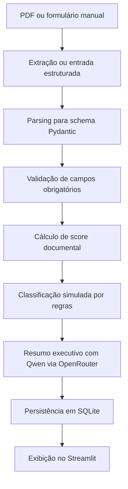

# Precatorio Insight Pipeline

MVP educacional de pré-análise de precatórios com FastAPI, Streamlit, SQLite e IA generativa via API OpenAI-compatible.

## Objetivo

O projeto simula uma esteira inicial de triagem de oportunidades de precatórios. Ele permite entrada manual ou upload de PDF, estrutura os dados em schemas Pydantic, valida campos mínimos, calcula um score de completude documental, aplica uma classificação comercial simulada e gera um resumo executivo com Qwen 14B/Qwen 3 14B via OpenRouter ou fallback determinístico.

Este sistema não emite parecer jurídico, não aprova crédito automaticamente e não deve ser usado com dados reais sensíveis. Ele foi criado como MVP demonstrativo para portfólio, entrevistas e estudo de automação aplicada a negócios.

## Como este projeto se conecta à vaga

Este projeto demonstra aplicação prática de IA generativa em um fluxo de negócio realista: triagem inicial de precatórios. A solução combina extração de dados, validação, classificação por regras transparentes, persistência em banco local e geração de resumo executivo com LLM. O objetivo é reduzir esforço manual, organizar informações críticas e apoiar times de negócio sem substituir análise humana especializada.

## Contexto de Negócio

Empresas de antecipação de precatórios precisam organizar documentos, identificar campos críticos, priorizar oportunidades e reduzir esforço manual na triagem. Este MVP mostra como IA generativa, validação de dados e automação podem apoiar essa etapa inicial sem substituir especialistas.

## Arquitetura

- `app/main.py`: aplicação FastAPI.
- `app/routes/analysis_routes.py`: endpoints de análise e histórico.
- `app/schemas.py`: contratos Pydantic de entrada e resposta.
- `app/services/pdf_extractor.py`: extração de texto de PDF com `pypdf`.
- `app/services/field_parser.py`: parsing heurístico de texto livre para dados estruturados.
- `app/services/validator.py`: validação de campos obrigatórios.
- `app/services/scorer.py`: score documental determinístico de 0 a 100.
- `app/services/classifier.py`: regras transparentes de classificação simulada.
- `app/services/llm_client.py`: integração OpenAI-compatible com Qwen via OpenRouter.
- `app/database.py`: persistência local em SQLite.
- `frontend/streamlit_app.py`: interface simples para uso do MVP.
- `tests/`: testes unitários das regras principais.
- `docs/ARCHITECTURE.md`: documentação técnica da pipeline.

## Fluxo da Pipeline



## Configuração

Crie um arquivo `.env` a partir do exemplo:

```bash
cp .env.example .env
```

No Windows PowerShell:

```powershell
Copy-Item .env.example .env
```

Preencha as variáveis:

```env
QWEN_API_KEY=sk-or-v1-sua-chave-aqui
QWEN_BASE_URL=https://openrouter.ai/api/v1
QWEN_MODEL=qwen/qwen3-14b
DATABASE_PATH=precatorio_insight.db
API_BASE_URL=http://localhost:8000
```

- `QWEN_API_KEY` é a chave da API do OpenRouter.
- `QWEN_BASE_URL` deve ser `https://openrouter.ai/api/v1`.
- `QWEN_MODEL` deve ser o ID do modelo usado no OpenRouter, por exemplo `qwen/qwen3-14b`.
- `DATABASE_PATH` define o arquivo SQLite local.
- `API_BASE_URL` é usado pelo Streamlit para chamar o backend.

A chave da LLM deve ficar apenas no `.env`. O sistema usa fallback determinístico se a LLM não estiver configurada ou se o provedor estiver indisponível.

## Instalação

```bash
pip install -r requirements.txt
```

## Rodar o Backend

```bash
uvicorn app.main:app --reload
```

A API ficará disponível em:

```text
http://localhost:8000
```

Documentação interativa:

```text
http://localhost:8000/docs
```

## Rodar o Streamlit

Com o backend ativo, execute:

```bash
streamlit run frontend/streamlit_app.py
```

## Comandos úteis

```bash
pip install -r requirements.txt
uvicorn app.main:app --reload
streamlit run frontend/streamlit_app.py
pytest
```

## Endpoints

- `GET /`: status da API.
- `POST /analyze/manual`: recebe JSON com dados do precatório.
- `POST /analyze/pdf`: recebe PDF, extrai texto e analisa.
- `GET /analyses`: lista análises salvas.
- `GET /analyses/{id}`: busca uma análise específica.

## Exemplo de Entrada Manual

```json
{
  "nome_credor": "Maria Silva",
  "numero_processo": "1234567-89.2024.8.26.0053",
  "tribunal": "TJSP",
  "ente_devedor": "Estado de São Paulo",
  "valor_estimado": 185000,
  "tipo_precatorio": "Estadual",
  "natureza": "Alimentar",
  "data_prevista_pagamento": "31/12/2026",
  "status_documental": "Parcial",
  "observacoes": "Exemplo fictício para teste."
}
```

Também há um arquivo de exemplo em `sample_data/exemplo_precatorio.txt`.

## Exemplo de Saída

```json
{
  "dados_estruturados": {
    "nome_credor": "Maria Silva",
    "numero_processo": "1234567-89.2024.8.26.0053",
    "tribunal": "TJSP",
    "ente_devedor": "Estado de São Paulo",
    "valor_estimado": 185000.0,
    "tipo_precatorio": "Estadual",
    "natureza": "Alimentar",
    "data_prevista_pagamento": "31/12/2026",
    "status_documental": "Parcial",
    "observacoes": "Exemplo fictício para teste."
  },
  "score_completude": {
    "score": 100,
    "criterios": {
      "nome_credor": 15,
      "numero_processo": 20,
      "ente_devedor": 15,
      "valor_estimado": 20,
      "natureza": 10,
      "tribunal": 10,
      "data_prevista_pagamento": 10
    }
  },
  "classificacao": "Alta prioridade comercial",
  "pendencias": [],
  "resumo_ia": {
    "resumo": "Caso fictício com dados mínimos identificados, bom nível de completude documental e prioridade comercial simulada alta. Recomenda-se revisão humana da documentação antes de qualquer decisão.",
    "gerado_por_ia": true,
    "modelo": "qwen/qwen3-14b",
    "avisos": []
  }
}
```

## Regras de Score

- `nome_credor`: +15
- `numero_processo`: +20
- `ente_devedor`: +15
- `valor_estimado`: +20
- `natureza`: +10
- `tribunal`: +10
- `data_prevista_pagamento`: +10

## Classificação Simulada

- Score abaixo de 50 ou valor ausente: `Dados insuficientes`
- Valor estimado abaixo de R$ 50.000: `Fora do perfil simulado`
- Campos obrigatórios pendentes: `Necessita revisão documental`
- Score a partir de 75 e valor a partir de R$ 50.000: `Alta prioridade comercial`
- Score a partir de 65 e valor a partir de R$ 50.000: `Média prioridade`
- Demais casos: `Necessita revisão documental`

## Testes

```bash
pytest
```

## Segurança e Limitações do MVP

- `.env` está no `.gitignore` e não deve ser versionado.
- Não coloque chaves reais em código, README, commits, issues ou prints públicos.
- Não use dados reais sensíveis.
- Não armazena documentos originais enviados, apenas análise estruturada e prévia curta do texto extraído.
- Não substitui análise jurídica, financeira, cadastral ou documental feita por especialistas.
- A extração de campos por PDF é heurística e pode falhar em documentos digitalizados como imagem.
- A classificação é simulada e serve apenas para demonstração técnica.
- A resposta da IA pode ficar indisponível se `QWEN_API_KEY` ou `QWEN_BASE_URL` não estiverem configurados; nesse caso, o sistema usa resumo determinístico.

## Como apresentar este projeto em entrevista

Eu desenvolvi um pipeline demonstrativo de apoio à pré-triagem de precatórios com IA generativa. A proposta foi simular um fluxo real de negócio, no qual documentos ou dados manuais são estruturados, validados, classificados por regras transparentes e resumidos por uma LLM. O foco do projeto não é substituir análise jurídica ou comercial humana, mas demonstrar como automação e IA podem reduzir esforço repetitivo, organizar informações críticas e acelerar uma primeira triagem.

## Screenshots

Screenshots reais da interface podem ser adicionados futuramente após uma rodada de uso local com dados fictícios.

## Melhorias Futuras

- OCR para PDFs escaneados.
- Docker e Docker Compose.
- Autenticação e controle de acesso.
- Fila assíncrona para processamento de documentos.
- Dashboard analítico com métricas de funil.
- Regras de negócio parametrizáveis por equipe.
- Observabilidade com logs estruturados.
- Testes de integração para API e frontend.
