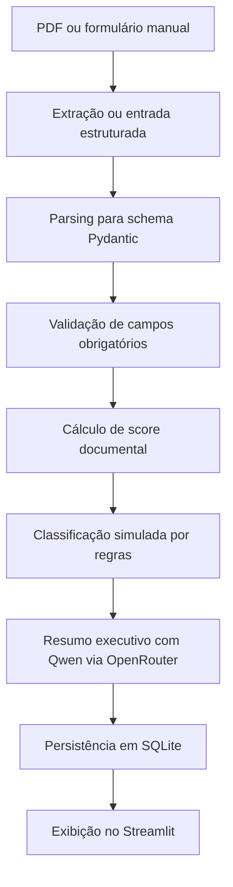

# Arquitetura do Precatorio Insight Pipeline

## Visão Geral

O Precatorio Insight Pipeline é um MVP educacional para pré-triagem simulada de precatórios. A aplicação recebe dados por formulário ou PDF, transforma o conteúdo em um objeto estruturado, valida campos mínimos, calcula um score documental, classifica a oportunidade por regras transparentes, gera um resumo executivo com Qwen via OpenRouter e salva a análise em SQLite.

O projeto não substitui análise jurídica, financeira, documental ou comercial. Ele demonstra como automação e IA generativa podem apoiar uma primeira organização de informações em um fluxo de negócio realista.

## Fluxo da Pipeline

## Responsabilidades dos Módulos

- `app/main.py`: inicializa a aplicação FastAPI, configura CORS e registra rotas.
- `app/config.py`: carrega variáveis de ambiente e centraliza configurações do projeto.
- `app/database.py`: cria conexão SQLite, inicializa tabela, salva e consulta análises.
- `app/models.py`: mantém a definição SQL da tabela local.
- `app/schemas.py`: define contratos Pydantic de entrada, score, resumo e análise final.
- `app/routes/analysis_routes.py`: expõe endpoints de análise manual, análise por PDF e histórico.
- `app/services/pdf_extractor.py`: extrai texto de PDFs enviados, sem armazenar o documento original.
- `app/services/field_parser.py`: aplica heurísticas simples para converter texto em campos estruturados.
- `app/services/validator.py`: identifica pendências em campos obrigatórios.
- `app/services/scorer.py`: calcula score determinístico de completude documental.
- `app/services/classifier.py`: aplica regras transparentes de priorização simulada.
- `app/services/llm_client.py`: chama a API OpenAI-compatible do OpenRouter ou usa fallback determinístico.
- `app/services/analyzer.py`: orquestra validação, score, classificação, resumo e persistência.
- `frontend/streamlit_app.py`: oferece interface simples para entrada manual, upload de PDF e histórico.
- `tests/`: cobre regras determinísticas, parser e fallback da LLM.

## Decisões Técnicas

- FastAPI foi usado para expor uma API clara, testável e fácil de demonstrar.
- Streamlit foi escolhido para entregar uma interface funcional com baixo custo de implementação.
- Pydantic centraliza validação e serialização de dados entre API, serviços e banco.
- SQLite mantém o MVP simples e executável localmente, sem infraestrutura externa.
- O parser é heurístico de propósito: ele demonstra extração básica sem mascarar limitações com uma dependência de LLM.
- A classificação é baseada em regras explícitas para facilitar explicação em entrevista e auditoria do comportamento.
- A integração LLM usa o padrão OpenAI-compatible, permitindo trocar provedor/modelo pelo `.env`.
- O fallback determinístico mantém a demonstração funcional mesmo sem configuração de API.

## Limitações do MVP

- PDFs escaneados como imagem podem exigir OCR.
- O parser não cobre todos os layouts reais de precatórios.
- A classificação não representa política comercial real.
- O resumo da LLM é auxiliar e não deve ser interpretado como parecer jurídico.
- Não há autenticação, autorização ou criptografia aplicada ao banco local.
- O projeto não deve processar dados reais sensíveis.

## Melhorias Futuras

- OCR para documentos digitalizados.
- Testes de integração para endpoints e fluxo completo.
- Docker e Docker Compose para execução padronizada.
- Autenticação e perfis de acesso.
- Dashboard analítico com métricas de triagem.
- Regras parametrizáveis por time de negócio.
- Observabilidade com logs estruturados.
- Exportação de relatórios em PDF ou planilha.
